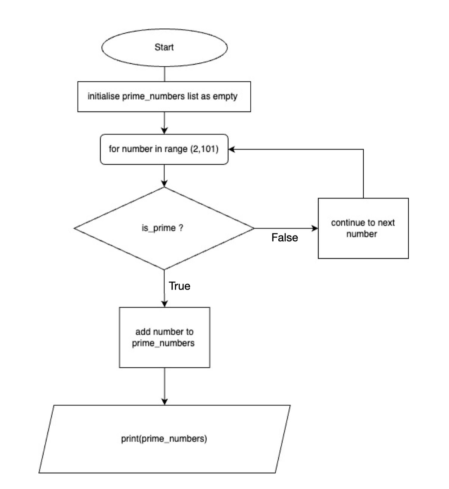

## T1A1 by Ellise Angel

#### Q1. Identify and explain common and important components and concepts of web development markup languages
Involved in web development is the creation and maintenance of websites and web applications. It refers to both the front-end and back-end of a website. 

In terms of front-end development, the developer is focused on the user interface and user experience of a website or web application.
Front-end development requires a range of skills in and knowledge in markup languages. The most common markup language is Hypertext Markup Language (HTML), which allows a developer to create the structure of a webpage and arrange the content with the use of tags. In HTML, tags define elements such as headings, links, paragraphs, images and more.These tags allow the user to choose how the content on a webpage is displayed. Semantic markup is a term used to describe the use of tags that are used that also convey a clear meaning. For example, the header element of a webpage is meaningfully defined as a < header > tag to improve search engine optimisation, code readability and accessiblity.

HTML provides the basic building blocks for a webpage, but the options to style the webpage visually is limited. To style the content and layout of the website, Cascading Style Sheets (CSS) are linked to an HTML document or multiple HTML documents to determine the visual appearance. CSS allows you to decide the fonts, colours and sizes of text elements. It allows you to set the padding and margins to allow space between elements. You can link one CSS to multiple HTML documents so that these styling options run throughout the whole website. However, you can also utilise CSS selectors to define the style of specific HTML elements based on their tag name. You can also use HTML to create a class of elements that have a certain style, and target this class with a class selector in CSS. You can also target an element more specifically by using an ID selector which is applied to an element with a specific ID attribute value. ID selectors have a higher specificity which will override any other styles defined by a selector with lower specificity (e.g. class selector). 

Specificity is a set of rules in CSS which determine which styles are applied to an HTML element. When there are many styles in a CSS that could potentially be conflicting, the selector with the highest specificity will be applied to the HTML element, however if two styles have the same value of specificity, the one defined last in the document will be prioritised. Specificity is calculated using the combination of selectors targeting an element. Inline styles have the highest specificity and are directly applied to an element using the style attribute; next is ID selectors; next is class selectors, attribute selectors an pseudo-classes which have the same specificity value; least in specificity are element selectors and pseudo-elements [1].

Other important aspects that are taken into consideration when using markup languages in web development are responsive design and accessibility. The responsive design approach to web development involves CSS grid, flexbox and media queries to ensure that a website's layout will be displayed nicely across a variety of screen sizes and dimensions. Designing a website's layout using multiple different sets of dimensions allows the developer to test how the page will appear to user of mobile, desktop and other devices. It is important to make a webpage adaptable to many devices because we can't design separately for every single device or combiantion of dimensions. Markup languages are important in developing accessible website so that they can be used by people with disabilities. For example, in HTML you can add alternative text to images for people with screenreaders or people who are visually impaired. Semantic markup also helps people with disabilities to navigate a webpage whcih is why it is important in HTML. 

Other than markup languages, there are other important parts of web development. For back-end devlepment, programming languages such as Python and Java are used to deal with the server-side functionalities of a website and data storage and handling among other things. 

#### Q2. Define the features of the following technologies that are essential in terms of the development of the internet and explain how each technology has contributed to the development of the internet:
##### Packets
A unit of data that is transmitted through the internet. When data is sent through the internet, it is divided into smaller units called packets. Packets have a header, a payload and a trailer [2]. A header contains information that tells you where the data is going and where it comes from (source and destination IP address) and a sequence number. When a packet arrives at its destination, it is reassembled correctly based on the sequence number. This process of dividing and reassembling of data is called packet switching. A payload is the data that is transmitted and it can be text, image, video and more. The trailer (sometimes known as a footer) tells receiver that the end of the packet has reached the destination and information for error checking [3]. Today's fast internet speeds are thanks to packet switching which allows for more efficient transmission of data over the internet. It also allows large files of different types to be transmitted as you can divide them into smaller packets which means we can share all sorts of files and content on the internet. The error-checking information that is contained in a packet also means that if a packet is lost in transmission, all of the data does not need to be re-sent, just that one particular packet which improves reliability of transmission. 
##### IP addresses (IPv4 and IPv6)
IP addresses (Internet Protocol addresses) are unique numbers assigned to devices connected to the internet [4]. There are two type of IP addresses. IPv4 addresses are 32-bit and represented as four sets of numbers (called an octet) separated by full stops (e.g. 01.102.103.104) [5]. IPv4 stands for Internet Protocol version 4. Since there are so many devices connected to the internet nowadays, we're running out of IPv4 addresses. IPv6 (Internet Protocol version 6) was developed to solve this by using 128-bit addresses. It uses longer addresss made up of numbers and letters in hexidecimal formation (e.g. 2001:db8:3333:4444:5555:6666:7777:8888). IP addresses allow devices to communicate to each other through the internet and ensures that information is sent to the correct device [6]. IP addresses have allowed people across the globe to connect via the internet through the expansion of IPv6 addresses allowing more and more people to partake in this global exchange of information. If there were no unique indentifier for each device, it wouldn't be possible for devices to locate destination IP addresses and therefore connect each user.
##### Routers and routing
Routers are devices that connect multiple networks together and allow data packets to be sent to and received by each other. Routers look at the destination address on th epacket and their routing tables to find the network or device that the packet should be sent to, as well as the directing it along the best path to ensure the data travels reliably across the internet [7]. Routing is the process that these devices use to determine the path that data should take to reach its destination [8]. Routers choose the msot efficient path which has icreased the speed at which data is transmitted through the internet. Routers also faciliate global connectivity as they interconnect different internet providers that you can send information to other devices no matter where in the world you are. 
##### Domains and DNS
The Domain Name System (DNS) translates domain names to IP addresses so browsers can load a webpage. This allows users to find websites without memorising an IP address. A domain name such as google.com is translated by the DNS into its corresponding IP address and connects the device to the website [9]. Domain names and DNS has, in a way, made the use of the internet available to many people who are not experts in information technology, as it gives websites a very readable and human-friendly name to websites and internet resources that is easier to remember or recognise. 


#### Q3. Define the features of the following technologies that are essential in terms of the development of the internet:
###### TCP
Transmission Control Protocol is one of the most common communications standard used to send data across the internet to exchange messages between different computing devices over a network [10]. It created a connection before data is transmitted and ensures data integrity by checking order that packets arrive at their destination IP. This has contributed to the development of the internet as it ensures reliable data transmissions which are improtant for any interactions taking place online and any information sent throughout the internet to reach its destination correctly and intact. 
 
 ###### HTTP and HTTPS
 HTTP stands for Hypertext Transfer Protocol and it is a protocol that allows a exchange of data in order to load webpages. A client device or application sends a server a request for information that is used to load a webpage and display the content [11]. The exchange of data takes place between a web browser and webpage [12]. Any websites that user user's login credentials or that need extra security use Hypertext Transfer Protocol Secure. The data that is transmitted between the user and the server is encrypted for security using an encryption protocol and only the owner of the website can decrypt it. HTTP enables the client and server communication and the security that is enabled through HTTPS has a led to the internet becoming a place where many sensitive user interactions can take place. For example, the encryption of personal details and financial transactions has allowed the World Wide Web to become a hub of electronic commerce and banking. 

 ###### Web browsers (requests, rendering and developer tools)
 A web brower is a software application that allows a user to access websites and diplay webpages on the internet. Examples of web browsers are Google Chrome and Safari. Web browsers have contributed to the development of client and server communication over the internet by communicating with a user through a grpahical user interface which makes it easier for a user to navigate a webpage and interact with information and content. Browsers are integral to the development of client and server communication over the internet as they play a vital role in processing HTTP and HTTP requests and the transmission of these requests to servers. This communication allows users to access URLs. Web browsers also interpret HTML and CSS code in order to present the GUI and content to the user once it receives the information requested from the server. 

##### Q4. Identify THREE data structures used in the Python programming language and explain the reasons for using each.

###### Lists
Lists in Python are mutable data structures that can store a sequence of data [12]. Items can be removed or added to a list. You would use a list for storing data of different types, and to store a collection of items that may change over time or that you want to manipulate based on certain conditions in a program.

###### Sets
Sets in Python are a collection of unique unordered elements [12]. You can use it to eliminate elements that are duplicate or 'not unique'. Sets in Python are contained in flower braces and the data within in can be used to perform mathematical operations, find common elements between sets, and to quickly find out whether an element is in a set or not. 

###### Dictionaries
Dictionaries in Python are data structures that use key-value pairs to store data [12]. It allows you to retreieve certain values later on in your code based on the corresponding key names. It is useful if you are wanting to use a collection of data that is going to be used a lot in the program and you want to be able to quickly retrieve that value anywhere else in the code just by calling the unique key.

##### Q5. Describe the features of interpreters and compilers and how they are different.

Both interpreters and compilers are tools for language translation and execution.

To execute some code, interpreters will translate and execute each line of code, one by one; a develoepr is therefore given instant feedback which allows them to begin the process of debugging. Contrastingly, compilers translate the entire source code into machine code or a lower-level representation before execution.

In order to translate the code, interepeters translate source code into machine code or an intermediate represenation without creating a separate executable file, whereas the translation process for compilers is significantly more complex: first is lexical analysis, parsing, semantic analysis, optmisation and code generation. This process creates an executable file that runs independently. Since compilers translate the source code only one time and at an earlier stage, the code is executed faster than interpreted code because the code is translated into machine code as it is running [13].

Interpeters allow for dynamic typing which lets you to assign variables and the types of variables will be checked as the code is being executed [14]. This allows a developer to be more flexible when writing their code, however the code may not run very efficiently. In comaprison, compilers have static typing, which means you must have explicity type declaration for your variables. This is less flexible, but allows early error detection and faster execution speed [15]. 

##### Q6. Identify TWO commonly used programming languages and explain the benefits and drawbacks of each.

###### Python
Python is a programming language has many uses and is widely used by programmers to build the server side of websites and software. Python is relatively easy to learn as it is designed to be read easily and its syntax and structure promotes code clarity and makes it more human-friendly to read and make meaning of the code as it is basically like reading English. This is why it is often recommended that coding beginners start by learning Python. 

It's also very versatile so you can use it along with a variety of libraries and frameworks that are used for many different purposes. For example, you can use Python along with Django and Flask for web dev, NumPy for for scientific computing, and TensorFlow for machine learning [16]. This minimises how many languages you need to learn and instead you can adapt one language to many different domains. 

Python uses an interpeter so it features dynamic typing which means that you can be more flexbible when assigning variables because you don't need to include explicity type declarations, but the performance may suffer as well as the execution speed because of this [17]. However, Python's line by line execution model makes it suitable for developers to test their code faster and enables more rapid prototyping. Another weakness of Python is that you cannot execute multiple threads concurrently because of Python's Global Interpreter Lock (GIL) [18].

###### C++
C++ is also very versatile and adaptable but it is more complex than Python. It is an extension of the C language that is often for web browser and software application development, operating systems, game development and databse management [19]. C++ is a complex programming language and has more intricate syntax, so it is more difficult for coding beginners to learn. However, C++ is a compiled language so the code is excuted faster and is a high performing progrmaming language. It is also portable which means that you can run a program on various operating systems and interface. Since C++ programs are compiled, it is suitable to use for projects that involve building hardware since it translates source code to low-level machine code. Other advantages include the level of scability as it can deal with an increasing amount of data [20].

##### Q7. Identify TWO ethical issues from the areas below and discuss the extent to which an IT professional is ethically responsible in terms of the issue.

###### Freedom of thought, conscience, speech and the media

Australia is a signatory to internation human rights treaties such as the Internation Covenant on Civil and Political Rights (ICCPR). Articles 19 and 20 protects the right to freedom of opinion and expression within Australia [21]. IT professionals working on websites, social media and news platforms must refer to these articles to ensure that users' freedom of opinion and expression is protected. The right to freedom of opinion means the right to hold opnions without interference and the the right to freedom of expression involves all forms of communication including media. However, IT professionals should also refer to the Racial Discrmination Act of 1975 and the Australian Human Rights Commission Act of 1986 [21], as certain forms of speech that promote hatred and discrimination are illegal. Furthermore, freedom of speech in Australia can also be also limited for reasons of national security, public health and public order. To tackle hate speech, harrassment and misinformation, developers and engineers can build automated systems to filter, review and moderate user-generated content. These must be designed to enforce community guildelines that must be in accordance with the law. Using machine learning, pattern recognition and natural language processing, IT professionals can tackle these ethical issues. For example, on the social media platform Twitter, there are hidden reply mechanisms to hide content that violate their guidelines. They have also launched Birdwatch in 2021 (now called Community Notes) where users can fact check information [22]. They also have a mechanism that prompts users to read articles and content linked in a Tweet before retweeting it. Twitter's algorithm's that determine what content that is shown to certain users can be effective in tailoring their experience on the platform and ensuring safety and protection from harrassment and explicit content, but it can also result in censorship as even automated systems and machine learning is subject to human biases. 

This gives rise to the issue of freedom of speech and censorship which played out in 2021 with the banning of Donald Trump from Twitter. Due to the larger cultural context and political climate, his posts were considered to be inciting violence and violated their Glorification of Violence policy [23]. However, the suspension of his account was decided after careful consideration and they took time to assess the Tweets against their policy. This generated debate about private companies and whether they should be able to censor people and regulate speech.

The ban was not completely within the domain of developers and IT professionals, and most likely was decided by specialists in legal and policy. However, developers still play a crucial role in moderating content according to their policies. In this example, the wider context of the current events influenced the way these Tweets were interpreted and the actions taken against them, which shows that the right to freedom of speech is fraught and subjective. IT professionals and developers must collaborate with policymakers and legal professionals so that they can design their platforms and systems in way that balances the right to freedom of expression with moral and ethical responsibilities, as well as legal standards. Developers are crucial in shaping the digital landscape in which we all participate; they must design algorithms that promote diverse thought and speech, but uphold truth and safety. As the digital landscape evolves, so will the laws that govern it, and IT professionals must build websites that adheres to these evolving regulations. 

###### Aggressive sales and marketing practices designed to mislead and deceive consumers
 One of the most important ways that a web developer is responsible for sales and marketing practices is in implementing and managing cookies on websites. Cookies are text files that a website sends to a user's device when the user visits a that domain and it is stored on their browser and device so that when they visit the website again the server can identify them and retreive that information. Examples of information that gets stored is login information, language preferences, items saved in a shopping cart, and sometimes browsing history in order to show you ads that are uniquely relevent to you. 

 Web developers are responsible for writing the code that sets cookies, implementing mechanisms that enable consent from the user to user cookies and manage their cookie preferences, deleting and managing information, ensuring security to prevent unauthorised access of cookies and adhering to the laws that determine what information can actually be stored and retrieved from users. Hence, web play a crucial role in writing and implementing code that adheres with laws and regulations. 

In 2012, the Wall Street Journal reported that Google had engaged in unauthorised data collection by setting cookies without user consent and in violation with Safari's privacy settings [26].Safari is Apple's default browser, but Google was able set cookies on iPhone and iPads through Google advertisements displayed on websites visited by Safari users. The developers manipulated the code so that when users visited websites that featured Google advertisements, it triggered the sending of third-party cookies to the user's browser. This was enabled by Google's DoubleClick advertising platform that allows them to display ads across different websites and was extremely deceptive as their ads include an invisible form submission which tells the browser that the third-party website has been interacted with by the user and allowed them to send cookies. This allowed Google to track and analyse user's browsing activity for different purposes including targeted advertising. Although Safari's privacy settings did not allow third-party cookies, Google was able to bypass this which gave rise to concerns about privacy, data sharing and user's consent and agency to manage their own preferences. Google's web developers held a significant amount of responsibility as they were the ones who wrote and implemented the code to find a loophole in Safari's privacy settings and exploit it to enable tracking in the pursuit of advertising revenue.

In 2011, Google had agreed to a consent agreement as they had already been charged by the Federal Trade Commission (FTC) of engaging in deception and breaking their own promises of user privacy through Google Buzz [25]. The Safari cookie loophole violated their own agreement and resulted in a $22.5 million civil penalty paid to the FTC which is a government agency in the United States whose mission is to protect the public from "deceptive or unfair business practices and from unfair methods of competition through law enforcement, advocacy, research, and education" [24]. 

The ethical liability of the Google developers and IT professionals in this case is very clear as they actively chose to code a deceptive form submission which is very to avoid. IT professionals must code in accordance with the principles and laws provided to them by regulatory bodies like the FTC. They must ensure that online interaction that takes place including the manipulation and management any personal information on the server side is practiced with the discretion of users in mind. They must prioritise user privacy above all else.

In terms of Australian law, developers can refer to the Privacy Act of 1988 for guidelines regarding data protection. There are thirteen Australian Privacy Protection Principles (APPs) within this Act that provide a framework for data protection [24]. 

These laws are flexible as they are guided by principles, which allow companies to interpret them flexibly which means that developers have to be extra careful, making sure to interpret them in the most conservative way to reduce the risk of violating the law. 

The APPs definitely assist developers in designing code ethically. APP1 delineates that organisations must "manage personal information in an open and transparent  way", this would include explicitly stating what personal information websites will collect and how it will be used. Therefore, developers must inform users of this before mechanisms that collect information are triggered. APP2 called 'Anonymity and pseudonymity' ensures that users have the option for their information to be stored anonymously, which means that their information will not be able to be linked to their real identity which is important in preventing identity theft in case of data breaches. This will guide developers in their management of information. APP7 is very relevant to the use of data collected through cookies as it is called 'Direct marketing' and states that "an organisation may only use or disclose personal information for direct marketing purposes if certain conditions are met". This prevents companies from deceiving users such as in the Google Safari cookie scandal. 

_All information in quotation marks in the above paragraph have been taken directly from Source [29]._


##### Q8. Explain control flow, using examples from the Python programming language
Control flow is the order in which a Python program executes each statement. You can determine how the program progresses from one instruction to another based on certain conditions or events.
You can achieve control flow through conditional statements and loops. 

Conditional statements
- if, elif, else 
- allows you to execute different blocks of code based on specific conditions

To illustrate, I will use my own code blocks that are a part of my other answers.

```
if is_raining == True and temp <= 15: 
 print("It's wet and cold :(")
elif is_raining == False and temp <= 15:
 print("It's not raining but it's cold!")
elif is_raining == False and temp >= 15:
 print("It's warm but not raining :)")
else:
 print("It's warm and raining !!!")
```

```
if is_raining == True and temp <= 15: 
 print("It's wet and cold")
```
The if statement tells Python to print different strings depending on if these statements are True or not. The if statement tells Python to print "It's wet and cold" if the conditions of is_raining being True and temp being less than or equal to 15 are met. 

```
elif is_raining == False and temp <= 15:
 print("It's not raining but it's cold!")
elif is_raining == False and temp >= 15:
 print("It's warm but not raining!)
```

the elif statements tell Python what to do in other specific conditions other than the original one in the if statement.elif means 'else if' and it allows you to build upon the instructions given in the if statement. If the if statement is not satisfied, the program executes the next elif block of code until the conditions are satisfied. In this case, if the first elif statement is satisfied and therefore the program prints the string "It's not raining but it's cold!", the program will not bother checking if the next elif statement is satisfied.

```
else:
 print("It's warm and raining !!!")
```
The else conditional statement allows you to tell the program what to do in the case that the previously stated conditions specified in the original if and elif statements aren't met. In this example, the instruction for the else statement is to print the string "It's warm and raining!!!" if is_raining is True and also the temp is larger than or equal to 15. These are the only remaining combinations of conditions left that can possibly occur so the else statement automatically checks for these without the same explicit stating of it such as in the elif statements. 

As you can see, the order that the program checks whether each set of conditions is met can be controlled by this series of conditional statements. 

Another way to achieve Python control flow is to utilise for and while loops. 

```
for skill_name in weightings.keys():
 print(skill_name)

```
This block of code uses a for loop which allows a program to perform a series of iterations in order to print key names from a dictionary. The loop iterates over the elements in the sequence and prints each one that is 'in' the dictionary called 'weightings' as a 'key'. It prints each key name on a separate line. 

```
while skill !='x':
    user_input_skills.append(skill)
    skill = input("Enter another skill (or 'x') to finish: ")
```
In this example, a while loop is used to execute an instruction for as long as the variable 'skill' does not equal 'x'. In this particular example it literally means that the loop will iterate as long as the user does not enter the string 'x'. The actual instruction that the loop is performing involves prompting the user to input a 'skill' which is a unique key name (defined in a dictionary not shown in the code block) and to append those elements in a list called user_input_skills. 

This while loop will repeat as long as the specified condition is true (i.e. 'x' has not been entered by user as a 'skill').

There are also the following Control Flow Keywords: break and continue. These Keywords allow you to manipulate the control flow even further and you can use it with other types of loops to account for certain conditions. 

Here is an example of using the break statement in a while loop (I didn't end up using this in my answer for question 15).

```
program_names = []
while True: 
    program_name = input ("Enter a skill, or please enter 'x' to finish: " )
    if program_name == 'x' :
        break 
    elif program_name:
     program_names.append(program_name)
```

In this case, the break statement is used to terminate the loop of prompting the user to input skills when the user enters 'x'. 

##### Q9. Explain the difference between type coercion and type conversion. Are either of these used in Python?
Type coercion is implicit type conversion that takes place automatically through in-built functions of the programming language. It converts from data of one type to a different data type. For example, in Python, type coercion is happening when you add an integer with a floating-point number. You don't need to explicitly add code that will convert an integer to a floating-point before adding those two numbers together because Python will automatically do that for you. 

If you do specify the conversion of one data type to another in the code, that conversion is called type conversion. In Python, you sometimes need to convert data types explicitly in order to use them or manipulate them in certain ways. For example, when performing mathematical operations number input by a user, the developer will include in the code a function to convert the string to an integer or float-point number first, because Python treats user input as a string unless you specify it convert into another data type. 

##### Q10. Explain data types, using examples
Data types in programming include integers, float-point numbers, strings, Booleans, characters, arrays and objects. The type of data determines what operations can be performed on the data and helps programming language to interpret and manipulate it. The data type also determines how much memory will be allocated to store it. 

Integers represent whole numbers with no fractional values. It can also be a negative number. Examples are integers are -1,0, and 1. A programming will store the integer value by allocating it a specific amount of memory. Integers can also be used in mathematical operations and logical operations.

Floating-point numbers are numbers that can have a fractional value and therefore can represent highly precise values. An example of a float is 3.000000001000008923748329.

Characters are a data type that represents a single character (e.g. 'A', '!', '?') and is often represented using the American Standard Code for Information Interchange (ASCII), where a numeric value between 0 and 127 is assigned to each character. Characters are usually 8-bit (1 byte) [30] You can use characters in logical and comparison operations, and can be concatenated to form strings. 

Strings are sequences or combinations of characters that are defined by either single or double quotation marks. Memory allcoation depends on the length of the string. Strings can be used to represent a value. You can concatenate strings ot make them longer, or remove portions, manipulate themand perform comparison operations. Programs can take strings as input and output. An example of a string is "Hello World!" 

Booleans data is used to show logical values: True or False. They are often used in logical operations, conditional statements and involved in control flow. They can also return the result of comparison operations (e.g. if you print 5 > 1, the output will be True). Booleans are very helpful in programming as they can direct the program's decision-making and flow. 

Arrays are collections of elements that are of the same data type. Similar to a list, each element has an index position within the array, the elements can be stored under a single variable name and the data can be accessed and manipulated. 
Examples of arrays are:

```
girl_names = ["Giselle", "Jennifer", "Stacy"]

ages_list = [23, 22, 26]
```
Each element has an index position. So "Giselle" will be 0, and 26 will be 2. 

##### Q11. Here’s the problem: “There is a restaurant serving a variety of food. The customers want to be able to buy food of their choice. All the staff just quit, how can you build an app to replace them?”
###### Table
The Table class will represent idividual tables and the attributes will include the table number and is_occupied. This will allow the customers to book a table and see which ones are available. 
###### Customer Order 
The Customer Order class will have attributes that store the items that have been, the table number the order should be sent to, price of items, an attribute that can call a function to calculate the total price. This information can be used later to generate a receipt. 
###### Menu
The menu class will define attributes related to the menu items like price and description. This will be especially relevant to front-end development of the website when information needs to be displayed in the menu to customers on the GUI. 
###### Kitchen 
The kitchen class will stores information about the status of the order. In this class, there will be functions defined including send_order: order is stored in the system and sent to kitchen; notify_staff: a function that notifies the kitchen staff and tells them what to make; being_prepared: a function that allows kitchen to update the app if the order is being prepared. 

 ##### Q12. Identify and explain the error in the code snippet below that is preventing correct execution of the program
 The error is that the the user input is treated by Python as a string, so you have to convert it to a number before it can be used in the fahrenheit calculation. 

 Using the float function around the input allows the string input to be converted to a float so it that mathematical operations can be perfomed. 

 ```
 celsius = float(input())

fahrenheit = (celsius*9/5)+32
print(f"The result is: {fahrenheit}.")
 ```

##### Q13. The code snippet below looks for the first two elements that are out of order and swaps them; however, it is not producing the correct results. Rewrite the code so that it works correctly.
```
numbers = [5, 22, 29, 39, 19, 51, 78, 96, 84]

i = 0

while (i < len(numbers) -1) and (numbers[i] < numbers[i+1]):
    i += 1
    
swap_this = numbers[i]

numbers[i] = numbers[i+1]
numbers[i+1] = swap_this 

print(i)
```
 
##### Q14. Demonstrate your algorithmic thinking through completing the following two tasks, in order:
 1. Create a flowchart to outline the steps for listing all prime numbers between 1 and 100 (inclusive). Your flowchart should make use of standard conventions for flowcharts to indicate processes, tasks, actions, or operations



 2. Write pseudocode for the process outlined in your flowchart

```
define a function called is_prime(number):
  for i in range from 2 to number - 1:
   if number is divisible by i:
    return False 
  return True for other numbers that don't meet these conditions 

intialise prime_numbers as an empty list 

for number in range from 2 to 101:
  if is_prime(number):
   append number to prime_numbers

print the prime_numbers list 
```

##### Q15. Write pseudocode OR Python code for the following problem: 
###### You have access to two variables: raining (boolean) and temperature (integer). If it’s raining and the temperature is less than 15 degrees, print to the screen “It’s wet and cold”, if it is less than 15 but not raining print “It’s not raining but cold”. If it’s greater than or equal to 15 but not raining print “It’s warm but not raining”, and otherwise tell them “It’s warm and raining”.

My Python code solution:
```
today_is_raining = input("Is it raining today? Type 'YES' or 'NO': ") 

is_raining = True if today_is_raining == 'YES' else False 

temp = float(input("What is the temperature today? ")) 

if is_raining == True and temp <= 15: 
  print("It's wet and cold :(")
elif is_raining == False and temp <= 15:
   print("It's not raining but it's cold!")
elif is_raining == False and temp >= 15:
   print("It's warm but not raining :)")
else:
   print("It's warm and raining !!!")
```

##### Q16. ACME Corporation coding skill program 

```
weightings = {
    'Python': 1,
    'Ruby': 2,
    'Bash': 4,
    'Git': 8,
    'HTML': 16,
    'TDD': 32,
    'CSS': 64,
    'JavaScript': 128
}

print("Skills required for the role:")

for skill_name in weightings.keys():
 print(skill_name)

print("Please note when entering a skill that program is case sensitive!")

user_input_skills = [] 

skill = input("Enter a skill from above (or 'x' to finish): ")

while skill !='x':
    user_input_skills.append(skill)
    skill = input("Enter another skill (or 'x') to finish: ")
       
user_score = 0

for skill in user_input_skills:
    if skill in weightings:
        user_score+=weightings[skill]   
       
print("Your coding skill score:", user_score)

missing_skills_score = sum(weightings[skill] for skill in weightings.keys() if skill not in user_input_skills)

print("You are missing the following skills: ")
for skill in weightings.keys():
    if skill not in user_input_skills:
        print(skill)

print("By learning these skills, you can improve your coding skill score by:", missing_skills_score, "!")
```


Sources
[1] https://developer.mozilla.org/en-US/docs/Web/CSS/Specificity
[2] https://www.techtarget.com/searchnetworking/definition/packet
[3] https://computer.howstuffworks.com/question525.htm
[4] https://www.geeksforgeeks.org/differences-between-ipv4-and-ipv6/
[5] https://www.ibm.com/docs/en/ts4500-tape-library?topic=functionality-ipv4-ipv6-address-formats
[6] https://www.kaspersky.com/resource-center/definitions/what-is-an-ip-address
[7] https://www.cloudflare.com/en-gb/learning/network-layer/what-is-a-router/
[8] https://www.cloudflare.com/en-gb/learning/network-layer/what-is-routing/
[9] https://www.cloudflare.com/en-gb/learning/dns/what-is-dns/
[10]https://www.fortinet.com/resources/cyberglossary/tcp-ip#:~:text=Transmission%20Control%20Protocol%20(TCP)%20is,data%20and%20messages%20over%20networks.
[11] https://www.cloudflare.com/en-gb/learning/ddos/glossary/hypertext-transfer-protocol-http/
[12] https://www.edureka.co/blog/data-structures-in-python/#datastructure
[13] https://www.geeksforgeeks.org/difference-between-compiler-and-interpreter/
[14] https://www.guru99.com/difference-compiler-vs-interpreter.html
[15] https://www.baeldung.com/cs/statically-vs-dynamically-typed-languages
[16]https://www.geeksforgeeks.org/libraries-in-python/
[17] https://realpython.com/lessons/dynamic-vs-static/
[18] https://peps.python.org/pep-0703/
[19] https://www.simplilearn.com/tutorials/cpp-tutorial/top-uses-of-c-plus-plus-programming#:~:text=in%20the%20Field-,What%20is%20C%2B%2B%20Used%20For%3F,engineering%2C%20data%20structures%2C%20etc.
[20] https://www.ko2.co.uk/advantages-disadvantages-of-c-plus-plus/
[21] https://www.ag.gov.au/rights-and-protections/human-rights-and-anti-discrimination/human-rights-scrutiny/public-sector-guidance-sheets/right-freedom-opinion-and-expression
[22] https://www.searchenginejournal.com/twitter-expands-community-notes-to-all-users/473911/#close
[23] https://blog.twitter.com/en_us/topics/company/2020/suspension
[24] https://www.ftc.gov/about-ftc/mission
[25] https://www.ftc.gov/news-events/news/press-releases/2011/03/
[26] ftc-charges-deceptive-privacy-practices-googles-rollout-its-buzz-social-network
[27] https://www.ftc.gov/news-events/news/press-releases/2012/08/google-will-pay-225-million-settle-ftc-charges-it-misrepresented-privacy-assurances-users-apples
[28] https://www.cookiebot.com/en/australia-privacy-policy/
[29] https://www.oaic.gov.au/privacy/australian-privacy-principles/australian-privacy-principles-quick-reference
[30] https://www.indeed.com/career-advice/career-development/data-type-examples


